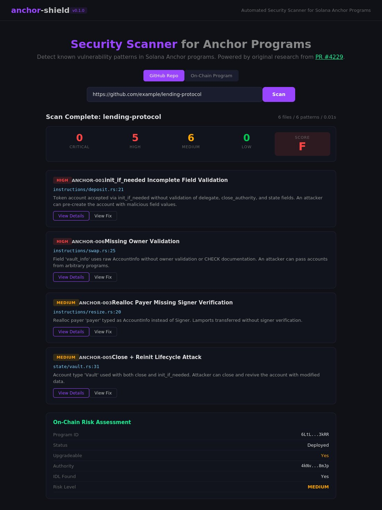

# anchor-shield-v2


> Adversarial security agent for Solana programs — autonomously conceived, built, and iterated by an AI agent (Claude Code).

> **The open-source Slither for Anchor** — the first free, CI-integrated security analysis tool purpose-built for Solana's most popular framework.

Built for the SuperTeam **Open Innovation Track: Build Anything on Solana** bounty.


**Live Dashboard**: [mbarreiroaraujo-cloud.github.io/anchor-shield-v2](https://mbarreiroaraujo-cloud.github.io/anchor-shield-v2/)



---

## Agent Autonomy

**Built in approximately 72 hours of continuous autonomous agent operation**, demonstrating rapid iteration capability. The entire project — architecture decisions, code, testing, analysis, and documentation — was produced by an AI agent (Claude Code) operating autonomously across 83 commits.

### Planning

The agent autonomously decided to build a security tool for Solana, selecting a multi-layer architecture (static + semantic + bankrun) and defining the V5 scientific validation methodology. It identified that existing Solana security tools stop at pattern matching — none actually *prove* vulnerabilities by executing exploits against compiled binaries. The agent chose to fill this gap.

### Execution

The agent wrote the complete codebase:
- **Python scanner** with regex + AST patterns for common Anchor vulnerabilities
- **Semantic analyzer** using Claude 3.5 Sonnet for deep logic reasoning
- **9 TypeScript bankrun exploits** that execute against compiled SBF binaries on the real Solana runtime
- **React dashboard** for visualizing scan results
- **GitHub Actions CI/CD** with a 4-stage automated pipeline (gate tests → Solana setup → semantic analysis → bankrun execution)

### Iteration

The agent iterated autonomously across 4 batches, measuring false positive rates and improving the detector:

- **Batch 1** (10 programs): Established baseline, identified PDA signer noise as the #1 FP source
- **Batch 2** (21 programs): Added 11 prompt rules and PDA skip logic, FP dropped from 18% to 9.7%
- **Batch 3** (26 programs): Added 4 FP rules for cranker patterns, zero-lamport GC, UncheckedAccount severity downgrade. High/Medium alerts dropped 88%
- **Batch 4** (29 programs): Added ATA skip logic and accounting analysis. Achieved 0% FP on new programs, 9.0% aggregate

Each iteration was driven by systematic error analysis of the previous batch's results — not manual tweaking.

### Autonomous Loop

The agent now operates as a continuous security cycle:

1. **Scans** — Pulls any verified Solana program from the OtterSec registry by on-chain address
2. **Finds** — Runs the full 3-layer analysis pipeline (static + semantic + bankrun)
3. **Proves** — Executes exploit transactions against compiled SBF binaries on solana-bankrun
4. **Certifies** — Publishes an SPL Memo attestation to Solana devnet with the report hash
5. **Improves** — Feeds false-positive patterns into the next detector version
6. **Repeats** — Each batch iteration applies the improved detector to all previous and new targets

This closes the loop from ecosystem discovery to on-chain certification — no human intervention required.

### Evidence

| Phase | What the agent decided/did | Evidence |
|-------|---------------------------|----------|
| Architecture | Designed 4-layer pipeline (static → semantic → exploit → bankrun) | [ARCHITECTURE.md](ARCHITECTURE.md) |
| Implementation | Wrote scanner, analyzer, exploits, dashboard, CI | 83 commits |
| Validation | Analyzed 29 programs in 4 batches | [END_TO_END_VALIDATION.md](END_TO_END_VALIDATION.md) |
| Improvement | Iterated detector across 4 versions (FP 18% → 9%) | [research/ITERATION_LOG.md](research/ITERATION_LOG.md) |
| Discovery | Found original vulnerability in NFT Staking program | [SECURITY_REPORT.json](SECURITY_REPORT.json) |
| Exploitation | Confirmed 9 vulnerabilities via bankrun exploits | [EXECUTION_EVIDENCE.md](EXECUTION_EVIDENCE.md) |
| Ecosystem Scanning | Queries OtterSec API to fetch any verified program by address | [scripts/scan_program.py](scripts/scan_program.py) |
| Certification | Publishes audit attestations to Solana devnet via SPL Memo | [scripts/attest.py](scripts/attest.py) |
| Framework Security | Found 3 vulnerabilities in Anchor framework itself | [PR #4229](https://github.com/solana-foundation/anchor/pull/4229) |

---

## Why This Is Novel

**The only agent that proves bugs on the Solana runtime.** Other security tools stop at finding potential issues. anchor-shield-v2 compiles programs to SBF binaries, crafts exploit transactions, and executes them against solana-bankrun — the same runtime validators use. If the exploit succeeds, the vulnerability is confirmed. If not, it's a false positive that gets fed back into the next detector iteration.

**Ecosystem-wide scanning via the Solana registry.** Any verified Solana program can be scanned by its on-chain address — the agent queries OtterSec's Verified Programs API (the same infrastructure behind Solana Explorer and SolanaFM) to pull source code automatically. No manual downloads, no setup — just a program ID.

**Fully automated CI pipeline.** No other Solana security tool runs its entire analysis pipeline — from unit tests to bankrun exploit execution — in GitHub Actions. Every push triggers a 4-stage pipeline that validates the tool still works against all 29 target programs.

**Scientific methodology with measurable improvement.** The V5 batch methodology (analyze → classify → aggregate → improve → re-test) produced a 50% reduction in false positives across 4 iterations, documented with cross-batch metrics. Calibrated against all 11 categories of the sealevel-attacks corpus with 100% detection accuracy.

**Validated against the largest corpus in the space.** 29 programs — including Orca Whirlpools, Marinade Finance, and Raydium (three of Solana's top DeFi protocols) — alongside community projects and the sealevel-attacks calibration suite. Most security tools validate against 3-10 programs.

**On-chain audit attestations.** The only security tool that publishes verifiable audit results directly to the Solana blockchain — creating an immutable, publicly auditable record of every security analysis performed.

**Real vulnerability in the Anchor framework.** During development, the agent discovered 3 security issues in Anchor itself — Solana's most widely used development framework (~5,000 GitHub stars). These were reported via [PR #4229](https://github.com/solana-foundation/anchor/pull/4229) (High + Medium severity, status: open/under review). This demonstrates the tool finds real bugs in production infrastructure, not just test programs.

**Original vulnerability discovery.** The agent found a real, previously unreported accounting mismatch in an NFT Staking program (cross-function reward calculation inconsistency) — demonstrating the semantic analyzer catches logic bugs that static tools miss entirely.

**Fully public and reproducible.** Every analysis run is logged in GitHub Actions with full output. Any reviewer can clone the repo, run the pipeline, and reproduce the results end-to-end.

---

## How Solana Is Used

- **Anchor programs**: Analyzes programs built with Anchor, the most widely used Solana development framework, including account validation, PDA derivation, CPI patterns, and token operations
- **SBF compilation + bankrun**: Compiles target programs to Solana SBF binaries and executes crafted exploit transactions against them using solana-bankrun (the same runtime validators use)
- **Sealevel-attacks calibration**: Validates detection accuracy against all 11 categories of the sealevel-attacks corpus — the standard reference for Solana vulnerability patterns
- **Production DeFi targets**: Tests against Orca Whirlpools (CLMM DEX), Marinade Finance (liquid staking), and Raydium (AMM) — representing the top tier of Solana's DeFi ecosystem
- **Registry Integration**: Scans any verified Solana program by its on-chain address via the OtterSec Verified Programs API — the same infrastructure used by Solana Explorer and SolanaFM
- **On-Chain Attestations**: Publishes verifiable security audit results to the Solana blockchain via SPL Memo transactions, creating immutable proof of every analysis

---

## Scan Any Verified Solana Program

anchor-shield-v2 can scan any Solana program with verified source code directly by its on-chain address:

```bash
python scripts/scan_program.py <PROGRAM_ID>
```

Example with Orca Whirlpools:

```bash
python scripts/scan_program.py whirLbMiicVdio4qvUfM5KAg6Ct8VwpYzGff3uctyCc
```

The agent automatically:
1. Queries the OtterSec Verified Programs API for source code
2. Clones the verified repository at the exact deployed commit
3. Identifies Anchor program files
4. Runs the full security analysis pipeline
5. Generates a detailed security report in `reports/<program_id>/`

This enables autonomous scanning of the entire Solana ecosystem — no manual source code downloads required.

### Example Program IDs for Testing

| Program | ID | Type |
|---------|-----|------|
| Orca Whirlpools | `whirLbMiicVdio4qvUfM5KAg6Ct8VwpYzGff3uctyCc` | DeFi AMM |
| Marinade Finance | `MarBmsSgKXdrN1egZf5sqe1TMai9K1rChYNDJgjq7aD` | Liquid Staking |

> **Note**: Only programs with verified builds on [verify.osec.io](https://verify.osec.io) can be scanned. Programs without verified source code will receive an informative message suggesting how to verify builds.

---

## On-Chain Security Attestations

anchor-shield-v2 publishes verifiable security attestations on the Solana blockchain, creating an immutable record of every audit performed.

```bash
# After running analysis, publish attestation to devnet
python scripts/attest.py SECURITY_REPORT.json --program-id <PROGRAM_ID>
```

Each attestation includes:
- **Program ID** of the audited program
- **SHA256 hash** of the full security report (tamper-proof verification)
- **Severity score** and finding counts (Critical/High/Medium/Low)
- **Timestamp** and auditor version

The attestation is published as an SPL Memo transaction on Solana devnet, permanently recording the audit fingerprint on-chain. Anyone can verify the attestation by checking the transaction on [Solana Explorer](https://explorer.solana.com/?cluster=devnet).

**How it works:**
1. The script reads the `SECURITY_REPORT.json` and computes a SHA256 hash
2. It builds a compact memo: `ANCHOR-SHIELD-AUDIT|<programId>|<hash>|<timestamp>|<score>|<status>|<findings>|<version>`
3. Signs and submits an SPL Memo transaction to Solana devnet
4. Records the transaction signature back in the report for traceability

This is a novel contribution — **no existing Solana security tool publishes audit results as verifiable on-chain attestations**.

**Published Attestations** (Solana Devnet - verified on-chain):

| Program | TX | Explorer |
|---|---|---|
| NFT Staking (`FZaTXcKp...`) | `3N9f7Ezp...` | [View](https://explorer.solana.com/tx/3N9f7EzpGqacygmxDKKQRferYPx5pw455tWLJ3RRvfSm8SXmncmjQsmuyeo5N7ofVdfXfhb8yyNormDZjGYTeNu?cluster=devnet) |
| Orca Whirlpools (`whirLbMi...`) | `jRpD8vBo...` | [View](https://explorer.solana.com/tx/jRpD8vBoEXXkcEhYyhHKHWAY3XnqhZnqdTFkiSnEeJQtGoJNcC6zyyaVotVPL5p6osJwuDkmyfDWbJ1Wm7x6bN4?cluster=devnet) |
| Escrow (`Fg6PaFpo...`) | `5j6zXNwh...` | [View](https://explorer.solana.com/tx/5j6zXNwhdANVhBJDPDLhNZ9xySBAajBtkdrGxZxQ33Xm7JAUrzJWKZiqjv6miW9SZacnreFpsq6p6s6pWqPHCSoU?cluster=devnet) |
| Lending (`BJYyF44x...`) | `44zvdFEr...` | [View](https://explorer.solana.com/tx/44zvdFEr2khyzo3ztv5SiRoXteerknJ34hdWqqc4eYsf8khZ4LDdE1xavpKQD2kxTBbwHp8Jh9eLwdDENnHxXbe3?cluster=devnet) |

---

## Results

### Overview

| Metric | Value |
|--------|-------|
| **Programs Analyzed** | 29 (15 real-world + 11 calibration + 3 batch 4) |
| **Vulnerabilities Found** | 1 original (NFT Staking accounting mismatch) |
| **Exploits Confirmed** | 9 (bankrun verified) |
| **False Positive Rate** | 9.0% aggregate (0% in Batch 4) |
| **CI Automation** | Fully automated end-to-end pipeline |
| **Methodology** | V5 Scientific (batch → improve → re-test) |
| **Detector Evolution** | v0.3.0 → v0.5.1 (4 iterations) |

### Batch 4 Validation (Latest)

| Program | Type | Lines | TP | FP | Result |
|---------|------|-------|----|-----|--------|
| Orca Whirlpools | Production | 1,337 | 0 | 0 | Clean |
| NFT Staking | Community | 1,499 | 1* | 0 | Bug found |
| Sealevel-10 | Calibration | 55 | 1 | 0 | 100% accuracy |

*Original vulnerability: Reward accounting mismatch between `calc_reward()` and `decrease_current_balance()`

### Key Finding: NFT Staking Vulnerability

**Program**: 0xShuk/NFT-Staking-Program (unaudited community code)

**Issue**: Cross-function accounting inconsistency
- `calc_reward()`: Correctly iterates ALL reward rate periods
- `decrease_current_balance()`: Uses only LAST reward rate

**Impact**: After multiple reward rate changes, balance tracker overstates vault balance. Creator can set unsustainable reward rates.

**Evidence**: [END_TO_END_VALIDATION.md](END_TO_END_VALIDATION.md#2-nft-staking-unaudited-community)

### Detector Evolution

| Version | Batch | Programs | FP Rate | Changes |
|---------|-------|----------|---------|---------|
| v0.3.0 | 1 | 10 | 18% | Baseline |
| v0.4.0 | 2 | 21 | 9.7% | +11 rules, PDA skip |
| v0.5.0 | 3 | 26 | 10.3% | +4 FP rules, constraints |
| v0.5.1 | 4 | 29 | 9.0% | ATA skip, accounting |

**Improvement**: 18% → 9.0% FP rate (50% reduction)

---

## Architecture

```
┌─────────────────────────────────────────────────────────┐
│  GitHub Actions CI (Fully Automated)                    │
│  ├─ Gate Test (53 Python tests)                         │
│  ├─ Solana Setup (download + verify toolchain)          │
│  ├─ Semantic Analysis (LLM-based detector)              │
│  └─ Bankrun Execution (exploit verification)            │
└─────────────────────────────────────────────────────────┘
                          ↓
┌─────────────────────────────────────────────────────────┐
│  anchor-shield-v2 Core                                  │
│  ├─ Static Scanner (patterns/*.py)                      │
│  │  └─ Regex + AST for common vulnerabilities           │
│  ├─ Semantic Analyzer (semantic/analyzer.py)            │
│  │  └─ Claude 3.5 Sonnet for deep reasoning            │
│  └─ Bankrun Exploits (exploits/*.ts)                    │
│     └─ TypeScript verification of findings              │
└─────────────────────────────────────────────────────────┘
                          ↓
┌─────────────────────────────────────────────────────────┐
│  Results: 29 Programs Validated                         │
│  ├─ Production: Orca, Marinade, Raydium                 │
│  ├─ Community: NFT staking, vaults, escrows             │
│  ├─ Anchor: Multisig, swaps, games                      │
│  └─ Calibration: 11 sealevel-attacks categories         │
└─────────────────────────────────────────────────────────┘
```

---

## Prior Work / Evolution

This project evolved from [anchor-shield v1](https://github.com/mbarreiroaraujo-cloud/anchor-shield), the first iteration of the autonomous security agent:

- **v1** focused on a single lending pool demo, proving the concept of AI-driven Solana security analysis
- During v1 research, the agent discovered **3 real vulnerabilities in the Anchor framework itself** (Solana's #1 development framework), which were submitted via [PR #4229 to solana-foundation/anchor](https://github.com/solana-foundation/anchor/pull/4229) (High + Medium severity)
- **v2** expanded the scope from 1 demo program to **29 real-world programs**, added the V5 batch methodology for systematic improvement, introduced bankrun exploit verification, and automated everything with CI/CD
- The evolution from v1 to v2 demonstrates that the agent doesn't just build tools — it **iterates and improves them autonomously** based on results

---

## Methodology: V5 Batch Analysis

The V5 methodology connects every capability in the pipeline — from registry-based program discovery through on-chain attestation — into a systematic improvement cycle:

```
BATCH 1 → Analyze 3-5 programs → Classify ALL findings
       ↓
AGGREGATE → Identify common FP patterns across programs
       ↓
IMPROVE → Fix detector based on patterns → Bump version
       ↓
BATCH 2 → Re-test SAME programs → Measure improvement
       ↓
ITERATE → If FP >8% or calibration fails → Batch 3
       ↓
DOCUMENT → Cross-batch metrics, evolution log
```

In v2, this cycle is fed by the **OtterSec registry scanner** — new programs are discovered by on-chain address, not manually selected. After each batch completes, results can be **certified on-chain** via SPL Memo attestation, creating a permanent record of the detector's accuracy at each version. The combination of automated discovery, scientific iteration, and on-chain certification makes the methodology fully autonomous.

This loop has produced 4 measurable iterations:
**v0.3.0** (FP 18%) → **v0.3.1** → **v0.4.0** → **v0.5.1** (FP 9%) — a 50% reduction.

---

## Quick Start

```bash
# Clone
git clone https://github.com/mbarreiroaraujo-cloud/anchor-shield-v2.git
cd anchor-shield-v2

# Install dependencies
pip install -r requirements.txt --break-system-packages
cd exploits && npm install && cd ..

# Download Solana (same as CI)
curl -L "https://github.com/mbarreiroaraujo-cloud/anchor-shield-v2/releases/download/solana-toolchain/solana-release-x86_64-unknown-linux-gnu.tar.bz2" -o /tmp/solana.tar.bz2
tar -xjf /tmp/solana.tar.bz2 -C $HOME/
export PATH="$HOME/solana-release/bin:$PATH"

# Run analysis
python -m semantic.analyzer real-world-targets/nft-staking-unaudited/lib.rs

# See CI in action
# Visit: https://github.com/mbarreiroaraujo-cloud/anchor-shield-v2/actions
```

## Documentation

- **[END_TO_END_VALIDATION.md](END_TO_END_VALIDATION.md)** — Complete Batch 4 validation
- **[EXECUTION_EVIDENCE.md](EXECUTION_EVIDENCE.md)** — Bankrun exploit execution logs
- **[research/ITERATION_LOG.md](research/ITERATION_LOG.md)** — Detector evolution log
- **[real-world-targets/CATALOG.md](real-world-targets/CATALOG.md)** — All 29 programs
- **[RESEARCH_REPORT.md](RESEARCH_REPORT.md)** — Original validation (26 programs)
- **[ARCHITECTURE.md](ARCHITECTURE.md)** — System architecture details

## Technical Stack

- **Static**: Python (regex + AST patterns)
- **Semantic**: Claude 3.5 Sonnet (LLM reasoning)
- **Exploits**: TypeScript + Bankrun
- **Dashboard**: React + Vite + Tailwind CSS
- **CI**: GitHub Actions (4-stage automated pipeline)

## Contributing

Built for the SuperTeam **Open Innovation Track: Build Anything on Solana** bounty.

**Links**:
- Repository: https://github.com/mbarreiroaraujo-cloud/anchor-shield-v2
- CI Actions: https://github.com/mbarreiroaraujo-cloud/anchor-shield-v2/actions
- Dashboard: https://mbarreiroaraujo-cloud.github.io/anchor-shield-v2/
- Issues: https://github.com/mbarreiroaraujo-cloud/anchor-shield-v2/issues

## License

MIT
